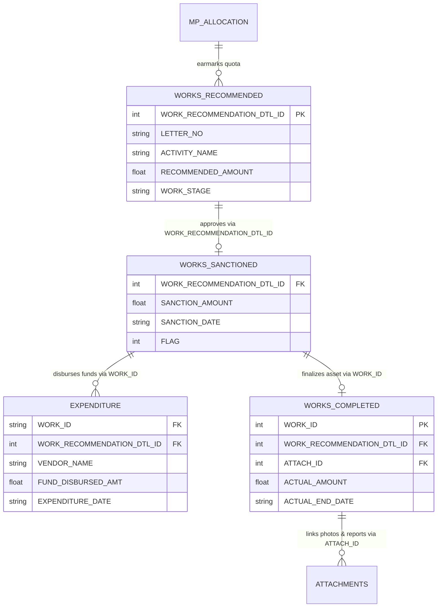

# MPLADS e-SAKSHI Portal — Complete REST API & Bulk Scraping Reference

> **Target Host:** `https://www.mplads.mospi.gov.in`  
> **Application:** Member of Parliament Local Area Development Scheme (MPLADS) — e-SAKSHI Citizen Dashboard  
> **Auth Requirements:** None (all listed endpoints are public pre-login REST endpoints)  
> **Default Protocol:** `POST` with `Content-Type: application/json; charset=utf-8`

---

## 1. Protocol Architecture & Parsing Rules

1. **HTTP Headers:**
   Always include the following headers in requests:
   ```http
   Content-Type: application/json; charset=utf-8
   User-Agent: Mozilla/5.0 (Windows NT 10.0; Win64; x64) AppleWebKit/537.36
   ```

2. **Double-Serialized JSON:**
   For tabular report endpoints (notably `/rest/PreLoginDashboardData/getTilesReportData`), the response object wraps the data in a JSON string.
   - Example Response:
     ```json
     {"Total Works Completed": "[{\"WORK_ID\":148495,...}]"}
     ```
   - Python handling:
     ```python
     raw = res.json()
     records = json.loads(raw["Total Works Completed"])
     ```

3. **Encoding Gotcha (Windows-1252 / ISO-8859 Bytes):**
   District authorities entering field data occasionally enter non-UTF8 characters (e.g. `\xd7` multiplication symbol `×` for work dimensions like `30×30 ft`). Always decode response bytes using `utf-8` with error replacement:
   ```python
   text = res.content.decode("utf-8", errors="replace")
   data = json.loads(text)
   ```

4. **Grand-Total Footer Row:**
   The last entry in dataset arrays is often a summary record (e.g. `{"Total_Amt": ...}`). When iterating through work records, filter out items lacking a primary key (`WORK_ID` or `MP_NAME`).

5. **House Codes:**
   - `2` = **Lok Sabha**
   - `1` = **Rajya Sabha**

---

## 2. Master Geographic & Political Hierarchy Endpoints

These endpoints provide the reference dimensions used to construct filter combos.

### 2.1 Get All States & Union Territories
- **Endpoint:** `POST /rest/PreLoginDashboardData/getStateData`
- **Payload:** `{}`
- **Response Schema:**
  ```json
  [
    {"STATE_NAME": "Delhi", "STATE_ID": 11},
    {"STATE_NAME": "Maharashtra", "STATE_ID": 20}
  ]
  ```

### 2.2 Get Tenures
- **Endpoint:** `POST /rest/PreLoginDashboardData/getTenureData`
- **Payload:**
  - For Lok Sabha: `{"uname": "0,0,0,2"}`
  - For Rajya Sabha: `{"uname": "0,0,0,1"}`
- **Response Schema:**
  ```json
  [
    {"ID": 5, "CAPTION": "17th Lok Sabha"},
    {"ID": 7, "CAPTION": "18th Lok Sabha"}
  ]
  ```
  *(For Rajya Sabha: `ID: 1` = Sitting, `ID: 2` = Retired)*

### 2.3 Get Constituencies by State
- **Endpoint:** `POST /rest/PreLoginDashboardData/getConstituencyData`
- **Payload:** `{"id": <STATE_ID>}`  
  *(e.g., `{"id": 11}` for Delhi)*
- **Response Schema:**
  ```json
  [
    {"ID": 98, "CAPTION": "NORTH WEST DELHI(SC)"},
    {"ID": 99, "CAPTION": "CHANDINI CHOWK"}
  ]
  ```

### 2.4 Get MPs by State, House & Tenure
- **Endpoint:** `POST /rest/PreLoginDashboardData/getMpNamesData`
- **Payload:** `{"state_combo": "<STATE_ID>,<HOUSE_CODE>,<TENURE_ID>"}`  
  *(e.g., `{"state_combo": "11,2,7"}` for Delhi, Lok Sabha, 18th LS)*
- **Response Schema:**
  ```json
  [
    {"ID": 3020007, "CAPTION": "Manoj Tiwari"},
    {"ID": 3045893, "CAPTION": "Bansuri Swaraj"}
  ]
  ```

### 2.5 Get MPs by Constituency, House & Tenure
- **Endpoint:** `POST /rest/PreLoginDashboardData/getMpAndConstCombo`
- **Payload:** `{"const_combo": "<CONSTITUENCY_ID>,<HOUSE_CODE>,<TENURE_ID>"}`

### 2.6 Full India Administrative Hierarchy (Districts, Blocks, Villages, Cities, Wards)
These endpoints are exposed under `/rest/PreLoginCitizenWorkRcmdRest/` and provide full geographic lookups:

| Level | Endpoint | Payload | Output Fields |
| :--- | :--- | :--- | :--- |
| **District by State** | `POST /rest/PreLoginCitizenWorkRcmdRest/getDistrictByState` | `{"stateId": 11}` | `DISTRICT_ID`, `DISTRICT_NAME` |
| **Block by District** *(Rural)* | `POST /rest/PreLoginCitizenWorkRcmdRest/getBlockByDistrict` | `{"districtId": 480239}` | `BLOCK_ID`, `BLOCK_NAME` |
| **Village by Block** *(Rural)* | `POST /rest/PreLoginCitizenWorkRcmdRest/getVillageByBlock` | `{"blockId": 12345}` | `VILLAGE_ID`, `VILLAGE_NAME` |
| **City by District** *(Urban)* | `POST /rest/PreLoginCitizenWorkRcmdRest/getCityByDistrict` | `{"districtId": 480239}` | `CITY_ID`, `CITY_NAME` |
| **Ward by City** *(Urban)* | `POST /rest/PreLoginCitizenWorkRcmdRest/getWardByCity` | `{"cityId": 10341}` | `WARD_ID`, `WARD_NAME` |
| **MP by District & State** | `POST /rest/PreLoginCitizenWorkRcmdRest/getMpByDistrictAndState` | `{"combo": "11,480239"}` | `MP_ID`, `MP_NAME` |

---

## 3. Core Granular Datasets (`getTilesReportData`)

This is the primary extraction endpoint for all project-level records, vendor disbursements, MP quotas, and calamity transfers.

- **Endpoint:** `POST /rest/PreLoginDashboardData/getTilesReportData`
- **Payload Structure:**
  ```json
  {
    "combo": "<STATE_ID>,<CONSTITUENCY_ID>,<MP_ID>,<HOUSE_CODE>",
    "key": "<DATASET_KEY>"
  }
  ```

### 3.1 Combo Syntax & Scope
- **All India (Lok Sabha):** `"0,0,0,2"`
- **All India (Rajya Sabha):** `"0,0,0,1"` *(Note: Live portal server frequently returns 503 for all-India RS combo; use state-level combos `"<STATE_ID>,0,0,1"` instead)*
- **State-level Scope:** `"<STATE_ID>,0,0,2"` *(e.g. `"11,0,0,2"` for Delhi Lok Sabha)*
- **Constituency Scope:** `"<STATE_ID>,<CONST_ID>,0,2"`
- **MP Scope:** `"<STATE_ID>,<CONST_ID>,<MP_ID>,2"`

### 3.2 Relational Model & Cross-Dataset Linkage

All six datasets and attachment endpoints share consistent foreign keys allowing complete end-to-end tracking of a work item:



---

### 3.3 Dataset 1: Works Recommended
- **Request Key (`key`):** `"Works Recommended"`
- **Response Key:** `"Total Works Recommended"`
- **Description:** Granular inventory of all developmental works recommended by MPs before sanction approval.
- **Request Example:**
  ```json
  {
    "combo": "11,0,0,2",
    "key": "Works Recommended"
  }
  ```
- **Raw Response Wrapper:**
  ```json
  {
    "Total Works Recommended": "[{\"Sno\":1,\"WORK_RECOMMENDATION_DTL_ID\":270936,\"LETTER_NO\":\"LN/MP18398/2025-2026/47\",\"RECOMMENDATION_DATE\":\"25-Feb-2026\",\"RECOMMENDED_AMOUNT\":941508.0,\"WORK_CATEGORY\":\"Normal/Others\",\"ACTIVITY_NAME\":\"WS/MP18398/2026-2027/270936-Fitting of Sitting RCC Benches in Public Places\",\"WORK_DESCRIPTION\":\"Providing and fixing of RCC Chair Benches in different locations in Baktawarpur Ward No 5\",\"WORK_STAGE\":\"Pending for Sanction\",\"SANCTION_AMOUNT\":941508.0,\"SANCTION_DATE\":\"03-Sep-2026\",\"FLAG\":1,\"STATE_NAME\":\"Delhi\",\"CONSTITUENCY_ID\":98,\"CONSTITUENCY\":\"NORTH WEST DELHI(SC)\",\"IDA_NAME\":\"NORTH WEST(COMMISSIONER NORTH WEST)\",\"MP_NAME\":\"Yogendra Chandoliya\",\"HOUSE_OF_PARLIAMENT\":2,\"TENURE\":\"18th Lok Sabha\",\"TENURE_START_DATE\":\"Jun 4, 2024 12:00:00 AM\",\"TENURE_END_DATE\":\"Jun 3, 2029 11:59:59 PM\"}]"
  }
  ```

#### Data Dictionary
| Field | Type | Nullable | Example | Description |
| :--- | :--- | :--- | :--- | :--- |
| `Sno` | Integer | No | `1` | Row sequence index in current query result set |
| `WORK_RECOMMENDATION_DTL_ID` | Integer | No | `270936` | **Primary Key** uniquely identifying the recommendation record |
| `LETTER_NO` | String | No | `"LN/MP18398/2025-2026/47"` | Official letter reference issued by MP office |
| `RECOMMENDATION_DATE` | String | No | `"25-Feb-2026"` | Date MP formally submitted the recommendation letter |
| `RECOMMENDED_AMOUNT` | Float | No | `941508.0` | Earmarked budget in Indian Rupees (INR) |
| `WORK_CATEGORY` | String | No | `"Normal/Others"` | Sector categorization (e.g. `Drinking Water`, `Health`, `Education`) |
| `ACTIVITY_NAME` | String | No | `"WS/MP18398/2026-2027/270936-..."` | System composite activity identifier and title |
| `WORK_DESCRIPTION` | String | Yes | `"Providing and fixing of RCC Benches..."` | Scope, technical specs, and location details |
| `WORK_STAGE` | String | No | `"Pending for Sanction"` | Status: `"Pending for Sanction"`, `"Sanction"`, etc. |
| `SANCTION_AMOUNT` | Float | Yes | `941508.0` | Preliminary sanction estimate |
| `SANCTION_DATE` | String | Yes | `"03-Sep-2026"` | Null if still pending; populated when sanction issued |
| `FLAG` | Integer | No | `1` | Workflow attachment stage indicator (`1` = Recommendation stage) |
| `STATE_NAME` | String | No | `"Delhi"` | State or Union Territory |
| `CONSTITUENCY_ID` | Integer | No | `98` | Foreign key matching `getConstituencyData` |
| `CONSTITUENCY` | String | No | `"NORTH WEST DELHI(SC)"` | Parliamentary constituency name |
| `IDA_NAME` | String | No | `"NORTH WEST(COMMISSIONER NORTH WEST)"` | Implementing District Authority (District Magistrate / Collector) |
| `MP_NAME` | String | No | `"Yogendra Chandoliya"` | Sponsoring Member of Parliament |
| `HOUSE_OF_PARLIAMENT` | Integer | No | `2` | `2` = Lok Sabha, `1` = Rajya Sabha |
| `TENURE` | String | No | `"18th Lok Sabha"` | Parliamentary tenure name |
| `TENURE_START_DATE` | String | No | `"Jun 4, 2024 12:00:00 AM"` | Term commencement timestamp |
| `TENURE_END_DATE` | String | No | `"Jun 3, 2029 11:59:59 PM"` | Term conclusion timestamp |

---

### 3.4 Dataset 2: Works Sanctioned
- **Request Key (`key`):** `"Works Sanctioned"`
- **Response Key:** `"Total Sanction Work"`
- **Description:** Projects evaluated for technical feasibility, cost estimation, and formally accorded administrative & financial sanction by the District Authority.
- **Request Example:**
  ```json
  {
    "combo": "11,0,0,2",
    "key": "Works Sanctioned"
  }
  ```
- **Response Schema:** Shares the same 21-column schema as Works Recommended with key milestone criteria:
  - `WORK_STAGE`: Strictly `"Sanction"`
  - `SANCTION_AMOUNT`: Officially approved budget allocation
  - `SANCTION_DATE`: Date administrative sanction was approved
  - `FLAG`: Advances to `2` (Sanction order attached)

---

### 3.5 Dataset 3: Works Completed
- **Request Key (`key`):** `"Works Completed"`
- **Response Key:** `"Total Works Completed"`
- **Description:** Physically verified community assets signed off by Implementing Agencies and IDAs following project completion and final payout.
- **Request Example:**
  ```json
  {
    "combo": "11,0,0,2",
    "key": "Works Completed"
  }
  ```
- **Raw Response Wrapper:**
  ```json
  {
    "Total Works Completed": "[{\"Sno\":1,\"WORK_ID\":148495,\"WORK_RECOMMENDATION_DTL_ID\":186044,\"LETTER_NO\":\"LN/MP880/2024-2025/50\",\"ACTIVITY_NAME\":\"WS/MP880/2025-2026/186044-Street lights\",\"WORK_CATEGORY\":\"Normal/Others\",\"WORK_DESCRIPTION\":\"Provision of Semi High Mast Pole with LED Light\",\"ACTUAL_AMOUNT\":1391353.0,\"ACTUAL_END_DATE\":\"09-Dec-2025\",\"ATTACH_ID\":1836498,\"FLAG\":3,\"FILE_STATUS\":true,\"AVERAGE_RATING\":0.0,\"STATE_NAME\":\"Delhi\",\"CONSTITUENCY_ID\":101,\"CONSTITUENCY\":\"NORTH EAST DELHI\",\"IDA_NAME\":\"CENTRAL(COMMISSIONER MCD (CENTRAL DISTRICT))\",\"MP_NAME\":\"Manoj Tiwari\"}]"
  }
  ```

#### Data Dictionary
| Field | Type | Nullable | Example | Description |
| :--- | :--- | :--- | :--- | :--- |
| `Sno` | Integer | No | `1` | Row sequence index |
| `WORK_ID` | Integer | No | `148495` | **Primary Unique Identifier** for the completed asset |
| `WORK_RECOMMENDATION_DTL_ID` | Integer | No | `186044` | Foreign key linking back to initial recommendation |
| `LETTER_NO` | String | No | `"LN/MP880/2024-2025/50"` | MP recommendation letter number |
| `ACTIVITY_NAME` | String | No | `"WS/MP880/2025-2026/186044-Street lights"` | Full activity code and title |
| `WORK_CATEGORY` | String | No | `"Normal/Others"` | Functional development sector |
| `WORK_DESCRIPTION` | String | Yes | `"Provision of Semi High Mast Pole..."` | Final verified scope of work |
| `ACTUAL_AMOUNT` | Float | No | `1391353.0` | Final total disbursement cost in Rupees |
| `ACTUAL_END_DATE` | String | No | `"09-Dec-2025"` | Official completion & commissioning date |
| `ATTACH_ID` | Integer | Yes | `1836498` | Media attachment group ID for completion photos and reports |
| `FLAG` | Integer | No | `3` | Stage flag (`3` = Completion / Handover) |
| `FILE_STATUS` | Boolean | No | `true` | `true` if inspection photos or completion orders are uploaded |
| `AVERAGE_RATING` | Float | No | `0.0` | Citizen feedback star rating (scale: 0.0 - 5.0) |
| `STATE_NAME` | String | No | `"Delhi"` | State / UT name |
| `CONSTITUENCY_ID` | Integer | No | `101` | Constituency identifier |
| `CONSTITUENCY` | String | No | `"NORTH EAST DELHI"` | Parliamentary constituency |
| `IDA_NAME` | String | No | `"CENTRAL(COMMISSIONER MCD...)"` | Implementing District Authority |
| `MP_NAME` | String | No | `"Manoj Tiwari"` | Hon'ble MP name |

---

### 3.6 Dataset 4: Expenditure on Completed and On-going Works as on Date
- **Request Key (`key`):** `"Expenditure on Completed and On-going Works as on Date"`
- **Response Key:** `"Total Expenditure"`
- **Description:** Itemized procurement and milestone disbursement transactions released to vendors, contractors, and implementing agencies.
- **Request Example:**
  ```json
  {
    "combo": "11,0,0,2",
    "key": "Expenditure on Completed and On-going Works as on Date"
  }
  ```
- **Raw Response Wrapper:**
  ```json
  {
    "Total Expenditure": "[{\"Sno\":1,\"WORK_ID\":\"WS/MP18400/2025-2026/199528\",\"WORK_RECOMMENDATION_DTL_ID\":199528,\"ACTIVITY_NAME\":\"Installation of multi-gym equipment\",\"VENDOR_NAME\":\"Radhey Mohan International\",\"VENDOR_ID\":43677,\"FUND_DISBURSED_AMT\":165416.0,\"EXPENDITURE_DATE\":\"19-May-2026\",\"WORK_STATUS\":\"Payment In-Progress\",\"IA_NAME\":\"Director(Hort)-II/(West)\",\"IDA_NAME\":\"WEST(COMMISSIONER MCD WEST)\",\"LETTER_NO\":\"LN/MP18400/2025-2026/21\",\"MP_NAME\":\"Kamaljeet Sehrawat\",\"HOUSE_OF_PARLIAMENT\":2,\"CONSTITUENCY\":\"WEST DELHI\",\"STATE_NAME\":\"Delhi\",\"TENURE\":\"18th Lok Sabha\",\"TENURE_START_DATE\":\"Jun 4, 2024 12:00:00 AM\",\"TENURE_END_DATE\":\"Jun 3, 2029 11:59:59 PM\"}]"
  }
  ```

#### Data Dictionary
| Field | Type | Nullable | Example | Description |
| :--- | :--- | :--- | :--- | :--- |
| `Sno` | Integer | No | `1` | Row sequence index |
| `WORK_ID` | String | No | `"WS/MP18400/2025-2026/199528"` | Project work code string |
| `WORK_RECOMMENDATION_DTL_ID` | Integer | No | `199528` | Recommendation detail foreign key |
| `ACTIVITY_NAME` | String | No | `"Installation of multi-gym equipment"` | Activity description |
| `VENDOR_NAME` | String | No | `"Radhey Mohan International"` | Beneficiary vendor or contracting entity |
| `VENDOR_ID` | Integer | No | `43677` | System vendor registration identifier |
| `FUND_DISBURSED_AMT` | Float | No | `165416.0` | Voucher disbursement amount in Rupees |
| `EXPENDITURE_DATE` | String | No | `"19-May-2026"` | Payment voucher clearance date |
| `WORK_STATUS` | String | No | `"Payment In-Progress"` | Status: `"Payment In-Progress"`, `"Completed"` |
| `IA_NAME` | String | No | `"Director(Hort)-II/(West)"` | Implementing Agency executing the physical work |
| `IDA_NAME` | String | No | `"WEST(COMMISSIONER MCD WEST)"` | Nodal Implementing District Authority |
| `LETTER_NO` | String | No | `"LN/MP18400/2025-2026/21"` | Sponsoring MP letter reference |
| `MP_NAME` | String | No | `"Kamaljeet Sehrawat"` | Member of Parliament |
| `HOUSE_OF_PARLIAMENT` | Integer | No | `2` | `2` = Lok Sabha, `1` = Rajya Sabha |
| `CONSTITUENCY` | String | No | `"WEST DELHI"` | Constituency name |
| `STATE_NAME` | String | No | `"Delhi"` | State / UT name |
| `TENURE` | String | No | `"18th Lok Sabha"` | Parliamentary tenure |
| `TENURE_START_DATE` | String | No | `"Jun 4, 2024 12:00:00 AM"` | Term start date |
| `TENURE_END_DATE` | String | No | `"Jun 3, 2029 11:59:59 PM"` | Term end date |

---

### 3.7 Dataset 5: Allocated Limit for Hon'ble MPs
- **Request Key (`key`):** `"Allocated Limit for Hon'ble MPs"`
- **Response Key:** `"Allocated Limit"`
- **Description:** Complete statutory allocation limits, entitlement quotas, and tenure dates for all Members of Parliament.
- **Request Example:**
  ```json
  {
    "combo": "0,0,0,2",
    "key": "Allocated Limit for Hon'ble MPs"
  }
  ```
- **Raw Response Wrapper:**
  ```json
  {
    "Allocated Limit": "[{\"Sno\":1,\"MP_NAME\":\"Bansuri Swaraj\",\"HOUSE_NAME\":\"Lok Sabha\",\"HOUSE_OF_PARLIAMENT\":\"2\",\"CONSTITUENCY\":\"NEW DELHI\",\"STATE_NAME\":\"Delhi\",\"ALLOCATED_AMT\":154306950.0,\"TENURE\":\"18th Lok Sabha\",\"TENURE_START_DATE\":\"Jun 4, 2024 12:00:00 AM\",\"TENURE_END_DATE\":\"Jun 3, 2029 11:59:59 PM\"}]"
  }
  ```

#### Data Dictionary
| Field | Type | Nullable | Example | Description |
| :--- | :--- | :--- | :--- | :--- |
| `Sno` | Integer | No | `1` | Row sequence index |
| `MP_NAME` | String | No | `"Bansuri Swaraj"` | Hon'ble MP name |
| `HOUSE_NAME` | String | No | `"Lok Sabha"` | House (`Lok Sabha` / `Rajya Sabha`) |
| `HOUSE_OF_PARLIAMENT` | String | No | `"2"` | House code |
| `CONSTITUENCY` | String | No | `"NEW DELHI"` | Parliamentary constituency name |
| `STATE_NAME` | String | No | `"Delhi"` | State / UT name |
| `ALLOCATED_AMT` | Float | No | `154306950.0` | Statutory entitlement limit allocated in Rupees |
| `TENURE` | String | No | `"18th Lok Sabha"` | Parliamentary tenure |
| `TENURE_START_DATE` | String | No | `"Jun 4, 2024 12:00:00 AM"` | Tenure commencement date |
| `TENURE_END_DATE` | String | No | `"Jun 3, 2029 11:59:59 PM"` | Tenure conclusion date |

---

### 3.8 Dataset 6: Amount Consented for Calamity
- **Request Key (`key`):** `"Amount consented for Calamity"`
- **Response Key:** `"Total Calimity Consent"`
- **Description:** MPLADS funds voluntarily contributed by MPs out of their annual quota towards relief and rehabilitation in areas affected by severe natural calamities.
- **Request Example:**
  ```json
  {
    "combo": "0,0,0,2",
    "key": "Amount consented for Calamity"
  }
  ```
- **Raw Response Wrapper:**
  ```json
  {
    "Total Calimity Consent": "[{\"Sno\":1,\"MP_NAME\":\"Dr. Subhas Sarkar\",\"CALAMITY_NAME\":\"Flood 2025 in Punjab\",\"TYPE\":\"State Calamity\",\"CONSENTED_AMOUNT\":5000000.0,\"CRT_DT\":\"12-Aug-2025\"},{\"Total_Amt\":40567400.0}]"
  }
  ```

#### Data Dictionary
| Field | Type | Nullable | Example | Description |
| :--- | :--- | :--- | :--- | :--- |
| `Sno` | Integer | Yes | `1` | Row index (absent on summary footer row) |
| `MP_NAME` | String | Yes | `"Dr. Subhas Sarkar"` | Hon'ble MP donating quota |
| `CALAMITY_NAME` | String | Yes | `"Flood 2025 in Punjab"` | Declared national or state calamity event |
| `TYPE` | String | Yes | `"State Calamity"` | Classification: `"National Calamity"` or `"State Calamity"` |
| `CONSENTED_AMOUNT` | Float | Yes | `5000000.0` | Donated relief sum in Rupees |
| `CRT_DT` | String | Yes | `"12-Aug-2025"` | Date consent was recorded in e-SAKSHI |
| `Total_Amt` | Float | Yes | `40567400.0` | Present on aggregate summary row |

---

## 4. Work Attachments, Inspection Photos & Completion Reports

Completed and sanctioned works feature inspection photographs and signed PDF orders.

### 4.1 Get File List for a Work
- **Endpoint:** `POST /rest/PreLoginDashboardData/getAttachIdsbyFlag`
- **Payload:**
  ```json
  {
    "json": {
      "FLAG": 3,
      "WORK_ID": 148495
    }
  }
  ```
- **Response Schema:**
  ```json
  [
    {
      "FILE_NAME": ["completion report 2.pdf", "asset_photograph.jpg"],
      "ATTACH_ID": ["1836498.1905867", "1836498.1905868"]
    }
  ]
  ```

### 4.2 Download Attachment Content (PDF/Image)
- **Endpoint:** `POST /rest/PreLoginCitizenWorkRcmdRest/getAttachmentById`
- **Payload:** `{"id": "<ATTACH_ID>"}`  
  *(e.g., `{"id": "1836498.1905867"}`)*
- **Response Schema:**
  ```json
  [
    {
      "FILE_NAME": "completion_report_2.pdf",
      "URL": "JVBERi0xLjQKJeLjz9MKNiAwIG9iago2NjQ4ODYK..."
    }
  ]
  ```
  *(The `URL` field contains raw base64 data. Decode to `.pdf` or `.jpg` using `base64.b64decode`)*

### 4.3 Work Reviews and Ratings
- **Endpoint:** `POST /rest/PreLoginCitizenWorkRcmdRest/getReviewDetailsByWork`
- **Payload:** `{"json": {"WORK_ID": 148495}}`
- **Response Schema:**
  ```json
  [
    {
      "STAR_RATING": 4,
      "REVIEW_DETAIL": "Drinking water fountain constructed and functional."
    }
  ]
  ```

---

## 5. Scheme Guidelines, User Manuals & Master Works List

The portal hosts public guidelines, SOPs, and the official permissible works catalog:

### 5.1 Query File Names
- **Endpoint:** `POST /rest/PreLoginDashboardData/get_fileNames`
- **Payloads:**
  - `{"content": "ENGLISH"}`
  - `{"content": "HINDI"}`
  - `{"content": "FORMS"}`
- **Sample Available Documents:**
  - `Updated Indicative list of work under MPLAD Scheme, Annexure-VIII.xlsx`
  - `English Guidelines w.e.f. 1st Apr 2023.pdf`
  - `MP User Manual April 2026 V 1.7.pdf`
  - `NDA User Manual April 2026 V1.7 2.pdf`
  - `IDA User Manual April 2026 V 1.7 1.pdf`
  - `IA User Manual April 2026 V1.7.pdf`
  - `Revised Audit Format.pdf`
  - `Steps for Holding account mapping and flagging of PFMS.pdf`
  - `Lok Sabha User Form.pdf`
  - `Rajya Sabha User Form.pdf`

### 5.2 Download Master Document
- **Endpoint:** `POST /rest/PreLoginDashboardData/getFileData`
- **Payload:**
  ```json
  {
    "json": {
      "content": "ENGLISH",
      "name": "Updated Indicative list of work under MPLAD Scheme, Annexure-VIII.xlsx"
    }
  }
  ```
- **Response:** Base64 string in `FileUrl`.

---

## 6. High-Level Aggregates & Dashboard KPI Endpoints

### 6.1 Current Active Tenure Tiles Data
- **Endpoint:** `POST /rest/PreLoginDashboardData/getTilesData`
- **Payload:** `{"uname": "<STATE_ID>,<CONST_ID>,<MP_ID>,<HOUSE_CODE>"}`  
  *(e.g., `{"uname": "0,0,0,2"}` for All India 18th Lok Sabha)*
- **Response Schema:**
  ```json
  {
    "Allocated Limit for Hon'ble MPs": ["₹83,41,87,02,273.80", "₹8,341.87 Crore"],
    "Expenditure on Completed and On-going Works as on Date": ["₹28,51,00,18,261.45", "₹2,851.00 Crore"],
    "Works Recommended": ["109412", "₹58,77,76,22,807.91", "₹5,877.76 Crore"],
    "Works Sanctioned": ["81466", "₹42,99,23,14,304.78", "₹4,299.23 Crore"],
    "Works Completed": ["35561", "₹17,47,63,38,846.73", "₹1,747.63 Crore"],
    "Amount consented for Calamity": ["12", "₹4,05,67,400.00", "₹4.06 Crore"],
    "Current Tenure": [{"ID": 7, "CAPTION": "18th Lok Sabha"}]
  }
  ```

### 6.2 Cumulative Lifetime Scheme Totals (Since April 1, 2023)
- **Endpoint:** `POST /rest/PreLoginDashboardData/getTotalTilesData`
- **Payload:** `{"uname": "0,0,0,2"}`
- **Response Schema:**
  ```json
  {
    "Allocated Limit": ["₹1,17,00,81,84,575.62", "₹11,700.82 Crore"],
    "Total Expenditure": ["₹41,18,74,76,786.14", "₹4,118.75 Crore"],
    "Total Works Recommended": ["135078"],
    "Total Sanction Works": ["101511"],
    "Total Works Completed": ["45704"]
  }
  ```

### 6.3 Active MP Count
- **Endpoint:** `POST /rest/PreLoginDashboardData/getTotalMPData`
- **Payload:** `{"uname": "0,0,0,2"}` → `{"Total Active MP": "539"}`

---

## 7. Deprecated / Inactive Endpoints

| Endpoint / Parameter | Status | Note |
| :--- | :--- | :--- |
| `/rest/PreLoginDashboardData/getgraphdata` | **503 Unavailable** | Billboard.js donut charts were disabled in `dashboard.html`. |
| Dataset Keys: `Rural`, `Urban`, `Trust and Society` | **503 Unavailable** | Old sub-breakdowns disabled when charts were removed. |
| 17th Lok Sabha Granular Works (`tenure=5`) | **503 Unavailable** | Pre-2023 data was handled physically; stored procedures are disabled on live server. |

---

## 8. Quick cURL Recipes

```bash
# 1. Download All-India MP Quotas for 18th Lok Sabha
curl -s -k -X POST "https://www.mplads.mospi.gov.in/rest/PreLoginDashboardData/getTilesReportData" \
  -H "Content-Type: application/json; charset=utf-8" \
  -d '{"combo":"0,0,0,2","key":"Allocated Limit for Hon\u0027ble MPs"}' -o all_india_quotas.json

# 2. Download Completed Works for Delhi
curl -s -k -X POST "https://www.mplads.mospi.gov.in/rest/PreLoginDashboardData/getTilesReportData" \
  -H "Content-Type: application/json; charset=utf-8" \
  -d '{"combo":"11,0,0,2","key":"Works Completed"}' -o delhi_completed_works.json

# 3. Download Vendor Payment Disbursements for Delhi
curl -s -k -X POST "https://www.mplads.mospi.gov.in/rest/PreLoginDashboardData/getTilesReportData" \
  -H "Content-Type: application/json; charset=utf-8" \
  -d '{"combo":"11,0,0,2","key":"Expenditure on Completed and On-going Works as on Date"}' -o delhi_vendor_payments.json

# 4. Fetch Attachment IDs for a Work
curl -s -k -X POST "https://www.mplads.mospi.gov.in/rest/PreLoginDashboardData/getAttachIdsbyFlag" \
  -H "Content-Type: application/json; charset=utf-8" \
  -d '{"json":{"FLAG":3,"WORK_ID":148495}}'
```
